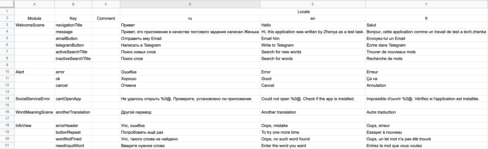
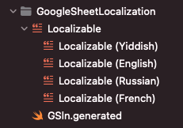

## GoogleSheetLocalizationExport

[](https://github.com/muzle/GoogleSheetLocalizationExport/blob/master/LICENSE)
[](https://codebeat.co/projects/github-com-muzle-googlesheetlocalizationexport-master)

Tool for converting google spreadsheet to a localization file.

## Result
From GoogleSheet table [like this](https://docs.google.com/spreadsheets/d/1sYkZSq28FAtVKKjACiaQDgq8Q6y79MwqYLENPXEb4o0/edit?usp=sharing):

You will get the following result:


```swift
internal enum GSln {
	internal enum WelcomeScene {
		/// Привет
		internal static let navigationTitle = GSln.tr("Localizable", "WelcomeScene.navigationTitle")
		/// Привет, это приложение в качестве тестового задания написал Женька
		internal static let message = GSln.tr("Localizable", "WelcomeScene.message")
		/// Отправить ему Email
		internal static let emailButton = GSln.tr("Localizable", "WelcomeScene.emailButton")
		/// Написать в Telegram
		internal static let telegramButton = GSln.tr("Localizable", "WelcomeScene.telegramButton")
		/// Поиск новых слов
		internal static let activeSearchTitle = GSln.tr("Localizable", "WelcomeScene.activeSearchTitle")
		/// Поиск слов
		internal static let inactiveSearchTitle = GSln.tr("Localizable", "WelcomeScene.inactiveSearchTitle")
	}
	...
}
```
And all the `.strings` files of your languages.

## Project Setup
1. To get started, you need to get a [gmail](https://www.google.com/intl/ru/gmail/about/) address, if you have one, you can proceed to step number 2
2. The program uses the [pygsheets library](https://pygsheets.readthedocs.io/en/stable/).
The next step you need to get 'client_secret.json’, the process is very well described in the [documentation for the library](https://pygsheets.readthedocs.io/en/stable/authorization.html#).
3. Download the [latest version](https://github.com/muzle/GoogleSheetLocalizationExport/releases/download/v.0.0.3/GoogleSheetLocalizationExport.zip) of the program. Place the `GoogleSheetLocalizationExport.exec` file in the directory of your project.
4. Create your GoogleSheetTable. [Test example](https://docs.google.com/spreadsheets/d/1sYkZSq28FAtVKKjACiaQDgq8Q6y79MwqYLENPXEb4o0/edit?usp=sharing)
5. Open the terminal and go to the directory of your project.
Enter the following command:
```console
muzle@MackBook-Pro GoogleSheetExample % ./GoogleSheetLocalizationExport cnfg
muzle@MackBook-Pro GoogleSheetExample %
```
As a result of the work, localization.xml file will be created. Open it and enter all the required data.

```yml
Configuration:
# The path to the file that you received after completing the second step.
  clientSecretPath: "googleusercontent.com.json"
# The path to the directory where the result of the program execution will be placed.
  destinationPath:
# URL address of your GoogleSheetTable.
  sheetUrl: "https://docs.google.com/spreadsheets/d/1gFzZZ6bueDUveyNITtTRfuZnrP2K6b6z8XcywR2L1ns/edit#gid=0"
# The name of GoogleSheet, for example `List1`.
  sheetKey:
# Column index of the module in your GoogleSheetTable.
  moduleColumn: 0
# Column index of the key in your GoogleSheetTable.
  keyColumn: 1
# Column index of the comment in your GoogleSheetTable.
  commentColumn: 2
# Column index of the locale in your GoogleSheetTable.
  localeColumn: 3
# Row index of the language type in your GoogleSheetTable.
  languageRow: 1
# Row index of the first entry of the module.
  contentRow: 2
```
6. Fetch localization with next command:
```console
muzle@MackBook-Pro GoogleSheetExample % ./GoogleSheetLocalizationExport fetch
muzle@MackBook-Pro GoogleSheetExample %
```

## Authors
Eugene Rudakov - [linkedin](https://www.linkedin.com/in/voragomod/)
